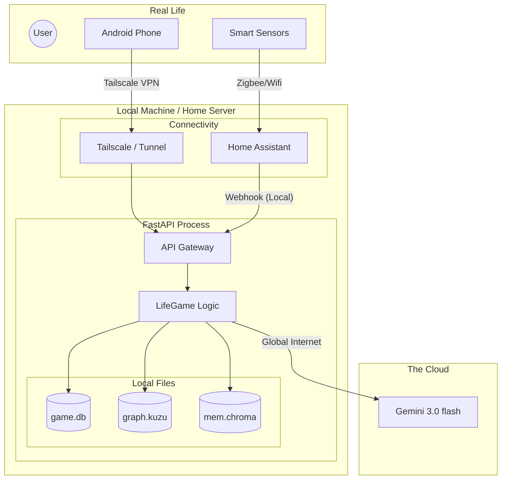

# The Cyborg Architecture: Strategic Hybrid Plan

本文件定義了「Cyborg Approach (賽博格混合體)」架構，並將其與您目前的 Azure 雲端架構進行深度對比。這套策略旨在結合 **"Embedded Trinity" (本地高性能)** 與 **"API Ecosystem" (雲端高智能)** 的最佳特性。

---

## I. 架構定義 (Architecture Definitions)

### 1. 現行架構 (Current: Azure Cloud Native)
目前系統部署於 Azure 雲端環境，依賴 PaaS 服務與 LINE Bot 作為主要交互介面。

*   **核心 (Core)**: FastAPI on Azure App Service (`B1` instance).
*   **記憶 (Memory)**: Azure Database for PostgreSQL (Flexible Server).
*   **感知 (Perception)**: LINE Messaging API (透過 Webhook).
*   **認知 (Cognition)**: Gemini Flash / OpenAI API (Cloud).
*   **關聯 (Graph)**: 無 (None) / 僅靠 Relational DB Join.
*   **網絡 (Network)**: Public DNS (`app-lifgame...`).

### 2. 混合架構 (Proposal: The Cyborg Approach)
將「大腦」留在雲端，將「身體」移回本地，並透過安全隧道連接。

*   **核心 (Core)**: FastAPI on Local Machine (or minimal VPS).
*   **記憶 (Memory)**: **SQLite** (Embedded) + **ChromaDB** (Local Vector).
*   **感知 (Perception)**: **Home Assistant** + **Tasker** (透過 Tailscale 隧道).
*   **認知 (Cognition)**: **Gemini 3.0 Flash** (Cloud - 保持高智商).
*   **關聯 (Graph)**: **KùzuDB** (Embedded - 本地圖資料庫).
*   **網絡 (Network)**: **Tailscale / Cloudflare Tunnel** (Mesh Network).

---

## II. 視覺化對比 (Visual Comparison)

### Diagram A: Current Architecture (Azure Stack)

```mermaid
graph TD
    subgraph User_Space [User World]
        User((User))
        LineApp[LINE App]
    end

    subgraph Azure_Cloud [Azure Infrastructure]
        AppService[App Service (FastAPI)]
        Postgres[(Azure PostgreSQL)]
        
        AppService --> Postgres
    end

    subgraph AI_Cloud [Model Providers]
        Gemini[Google Gemini API]
    end

    User --> LineApp
    LineApp -- Webhook (HTTPS) --> AppService
    AppService -- API Call --> Gemini
```

### Diagram B: The Cyborg Architecture (Hybrid Stack)



---

## III. 詳細對比矩陣 (Detailed Comparison Matrix)

| 維度 (Dimension) | 目前架構 (Current: Azure) | 混合架構 (Cyborg: Local+Cloud) | 差異分析 (Analysis) |
| :--- | :--- | :--- | :--- |
| **成本結構 (Cost)** | **每月付費** (App Service + Postgres) <br> 即使 Free Tier 也有隱形成本與限制。 | **接近 $0** (僅電費) <br> 利用現有硬體 + 免費 Cloud LLM。 | **Cyborg 勝** 🏆 <br> 徹底消除 "Idle Cost"焦慮。 |
| **資料主權 (Sovereignty)** | **託管型** <br> 資料在 Azure 上，需依賴匯出工具備份。 | **檔案型** <br> 整個 `data/` 資料夾即資料庫，複製即備份。 | **Cyborg 勝** 🏆 <br> 備份與遷移極其簡單。 |
| **感測能力 (Sensing)** | **被動 (Passive)** <br> 依賴 User 主動在 LINE 輸入文字。 | **主動 (Active)** <br> 手機/環境感測器主動推送 (GPS, 睡眠, 應用程式使用)。 | **Cyborg 勝** 🏆 <br> 可以實現「你不說話，我也知道你在熬夜」。 |
| **連線便利性 (Connectivity)** | **極佳** <br> 公網 URL，任何設備皆可連。 | **受限** <br> 需安裝 Tailscale 或設定 Tunnel 才能連線。 | **Current 勝** 🏆 <br> 分享給朋友或跨設備時較方便。 |
| **運算延遲 (Latency)** | **中等** <br> DB 與 App 分離，網路來回需時間。 | **極低** <br> In-Process DB (SQLite/Kuzu)，零網路延遲。 | **Cyborg 勝** 🏆 <br> 對於頻繁讀寫的操作更有感。 |
| **AI 智商 (Intelligence)** | **高** (Cloud LLM) | **高** (Cloud LLM) | **平手** 🤝 <br> Cyborg 策略堅持不使用 Local LLM 以換取最佳效果。 |
| **圖譜能力 (Graph)** | **無** (關聯性弱) | **強** (KùzuDB) | **Cyborg 勝** 🏆 <br> 能夠建立 NPC 關係網與複雜敘事。 |

---

## IV. 實施 Cyborg 架構的關鍵步驟

若要從目前的 Azure 架構轉向 Cyborg 架構，建議路徑：

1.  **資料降維 (Data Downgrade)**:
    *   將 Azure Postgres 數據匯出。
    *   使用 `sqlalchemy` 將數據導入本地 SQLite (`game.db`)。
    *   配置 FastAPI 使用 `sqlite+aiosqlite`。

2.  **建立神經網 (Network Mesh)**:
    *   在主機 (你的電腦) 安裝 Tailscale。
    *   在手機安裝 Tailscale App。
    *   確認手機這時可以用 `http://100.x.y.z:8000` 連上電腦的 FastAPI。

3.  **接入感官 (Sensory Input)**:
    *   安裝 Home Assistant (Docker)。
    *   設置 HA Automation: 當手機 `Screen On` -> Call FastAPI `/api/webhook/screen_event`。

4.  **注入圖譜 (Graph Injection)**:
    *   `pip install kuzu`。
    *   開始在新的 `LoreService` 中使用 KùzuDB 存儲劇情關係。

## 5. 結論 (Conclusion)

**Cyborg Approach** 是個人開發者 (Solo Developer) 的甜蜜點。
它避免了地端 LLM 的沈重負擔，同時保留了地端資料庫的極速與掌控權。
雖然犧牲了一點「隨處連線」的便利性 (需開 VPN)，但換來的是一個**零成本、高感知、且深度客製化**的生命系統。
