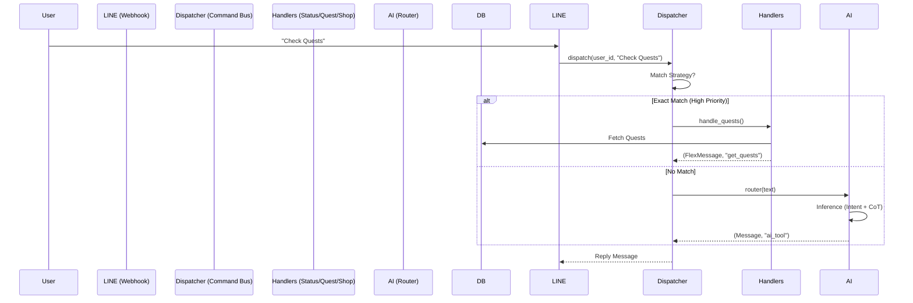

# LifeOS Architecture v2.0

## Overview
LifeOS is an AI-Native Gamification System that turns daily life into an RPG.
It acts as a "Life Operating System" via LINE Messenger.

## Core Architecture: The "Command Bus"
In v2.0, we moved from a monolithic webhook to a Command Bus pattern to support scalability.

## Directory Structure
-   `app/core/dispatcher.py`: The routing engine.
-   `app/api/handlers.py`: Standard command logic (Status, Quests, Shop).
-   `app/services/ai_service.py`: LLM integration for complex intents.
-   `app/api/webhook.py`: Entry point (initializes Dispatcher).

## Key Components

### 1. The Brain (AI Service)
-   **Model**: Gemini Pro via `google.genai`.
-   **Responsibility**: Parsing fuzzy input ("I feel tired", "I drank water") into structured game actions.
-   **Localization**: Strictly enforced Traditional Chinese prompt engineering.

### 2. Gamification Engine (User Service)
-   **System 1 (Fast)**: Regex-based immediate feedback (e.g., "gym" -> STR +1).
-   **System 2 (Slow)**: AI analysis for complex journal entries.
-   **Nemesis System**: "Viper" (Rival AI) monitors inactivity and mocks the user.

### 3. Database Schema (PostgreSQL)
-   `users`: Core stats (Level, XP, HP, Gold).
-   `quests`: Active tasks (Daily, Main, Side).
-   `habit_states`: Persistent habit tracking (DDA-enabled).
    -   *Note*: `habit_tag` is the canonical ID. `habit_name` is for display.
-   `lore_entries`: Narrative history generated by AI.

## Deployment
-   **Platform**: Azure App Service (Containerized).
-   **CI/CD**: GitHub Actions -> Azure Container Registry (`lifgameacr...`).
-   **Env Vars**: `AUTO_MIGRATE=1` ensures Alembic migrations run on startup.
